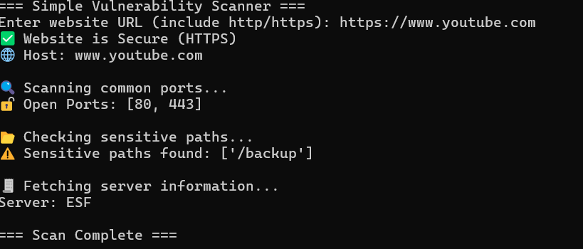

# 🛡️ VULNSC - Vulnerability Scanner

A Python-based vulnerability scanner with both CLI and GUI support.  
Designed for basic reconnaissance, port scanning, and web security analysis.

---

## ⚔️ Features

- 🔍 Port Scanning (Common Ports)
- 🌐 HTTPS Security Check
- 📂 Sensitive Path Discovery
- 🧾 Server Header Analysis
- 🖥️ GUI-based Scanner (Tkinter)
- ⚡ Fast and lightweight

---

## 🛠️ Tech Stack

- Python
- Socket Programming
- Requests Library
- Tkinter (GUI)

---

## 🚀 How to Run

### CLI Version
```bash
python scanner.py

## 📸 Screenshots




